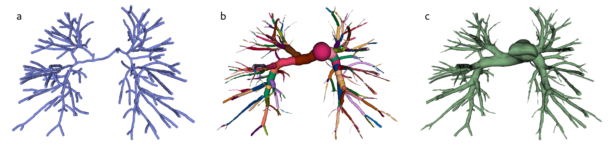
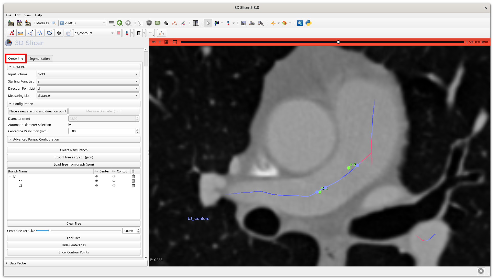
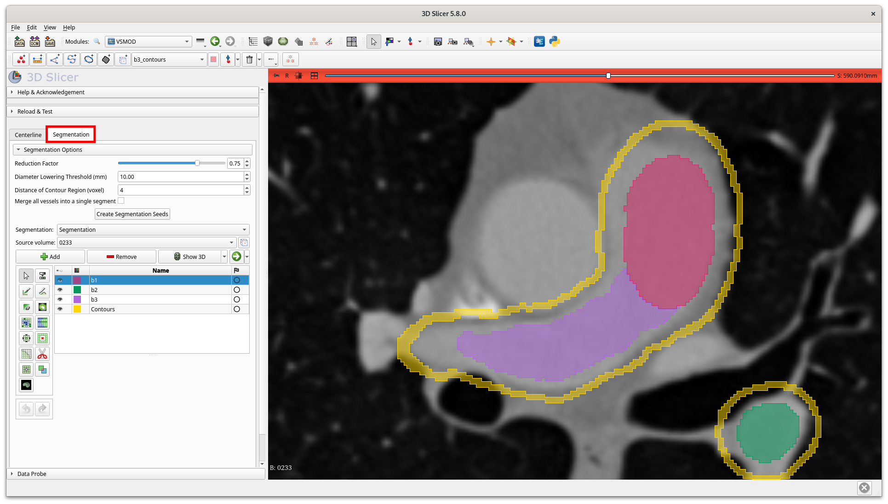
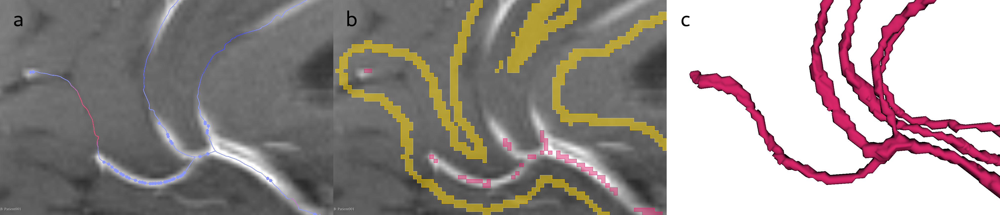

# Summary

The volumetric annotation of vessels in medical images is a challenging
and time-consuming task that typically requires extensive expert manual
work. *VSMOD* is a free, user-friendly plugin for 3D Slicer [\[1\]](#ref1)
designed to simplify and lighten the vascular annotation process.
*VSMOD* offers a semi-automatic two-step segmentation approach, that
combines RANSAC-based centerline detection [\[2\]](#ref2) and a region growing
approach with automatic seed selection to accelerate vessel annotation.
Users can interactively generate vessel centerlines by placing two
points -- one marking the vessel's starting location, and the other
indicating its initial direction thereby defining a branch. Additional
branches are created by tracking new branch near existing ones. From
these centerlines, a vascular tree graph is automatically constructed
and can be exported as a NetworkX graph [\[3\]](#ref3), facilitating efficient
data storage and external manipulation. Finally, a region growing
segmentation is applied using seeds automatically derived from the
centerlines.

Initially designed for pulmonary artery annotation, *VSMOD*'s
methodology is adaptable to various vascular structures across different
organs (e.g., brain, liver). This plugin significantly reduces the time
required to obtain complete volumetric vessel segmentation. Moreover, it
generates fully connected vascular trees with precise topology, which is
nearly impossible to achieve with conventional annotation tools.

*VSMOD* enables users to create accurate and topologically consistent
vascular network annotations, facilitating large-scale supervised
machine-learning dataset generation for vascular segmentation. Future
developments will focus on improving the segmentation step using deep
learning-based approaches and further assessing the framework's
generalizability across diverse vascular segmentation tasks. The plugin
is available at this [Github Repo](https://github.com/omerveille/VSMOD).

# Statement of need

Accurate annotation of vascular networks in medical imaging remains a
critical challenge and is essential to develop accurate deep
learning-based segmentation models. Current segmentation models still
struggle with preserving the connectivity of complex vascular networks
which is crucial for downstream tasks such as flow dynamic simulations.
Improving the quality and precision of annotated datasets is crucial for
training more effective models. However, traditional manual annotation
methods are extremely time-consuming and subject to inter-observer
variability creating important concept shifts in the annotation,
ultimately leading to lower model performance [\[4\]](#ref4).

Existing vessel annotation tools have notable limitations. Traditional
paint and brush tools in image analysis software such as *3D
Slicer*[¹](https://www.slicer.org/ "3D Slicer") [\[5\]](#ref5) or
*ImageJ*[²](https://imagej.net/ij/ "ImageJ") required slice-by-slice
pixel-level annotation, making the process extremely laborious and often
resulting in disconnected segmentations. Tubular shape prior tools have
been proposed, such as the *Draw Tube* tool from the
[SlicerSegmentEditorExtraEffects
extension](https://github.com/lassoan/SlicerSegmentEditorExtraEffects).
However, this method requires manually drawing each vessel separately,
and its fixed tubular shape is poorly suited for real vessels, which
exhibit tortuosity and variable radii. Additionally, constructing a
fully connected vascular tree remains particularly challenging.

Recently, Lamy *et al.* proposed the *RVXLiverSegmentation* plugin [\[6\]](#ref6)
for 3D Slicer to segment hepatic vascular networks. This tool enables
fast and accurate vascular segmentation by requiring users to place
predetermined points at branching nodes. However, it is designed
specifically for the hepatic vasculature and is not applicable to other
organs. *VSMOD* is designed to overcome these limitations by providing a
user-friendly plugin for efficiently generating accurate and
topologically correct vascular segmentations.

# Overview of VSMOD

*VSMOD* integrates two complementary modules (cf. Fig. [1](#fig1)).
First, the **centerline module** uses a RANSAC centerline tracking
algorithm to create a graph model of the vascular network, ensuring that
parent-child relationships between vessels are preserved, and providing
precise geometry and radius estimation. Then, the **segmentation
module** automatically generates seeds to initialize a region growing
segmentation yielding a completely connected vascular segmentation.

Figure 1: Example of the annotation
process on pulmonary arteries. From left to right: a) Centerlines
detected using the RANSAC-based algorithm. b) 3D visualization of
automatically placed seeds for region-growing. c) The final vessel
segmentation.

## Centerline Module

Figure 2: Example of the centerline
module interface. Green dots represent user-selected points, while blue
and pink lines indicate centerlines detected by the RANSAC algorithm.
The bottom-left panel displays the vascular graph, where the b1 branch
splits into b2 and b3.

The first module of *VSMOD* extracts vessel centerlines (cf. Fig.
[2](#fig2)). Users begin by placing starting and directional points to
define the initial vessel path. Then, the RANSAC algorithm [\[2\]](#ref2)
iteratively tracks points along the vessel centerline. At vessel
intersections, the algorithm randomly selects a branch and continues
tracking until it reaches the end of the vessel. To annotate additional
vessels, the user selects two new points near an existing centerline.
The algorithm then automatically detects the new branch and connects it
to the previously identified centerlines. An estimate of the diameter of
the vessel at the beginning of the vessel has to be set when launching
the algorithm the first time. This is the only parameter that is
required. The other RANSAC algorithm parameters can be set manually by
the user for a fine user control, but good default values are provided.

Additionally, this module enables users to export and load a vascular
network as a NetworkX graph [\[3\]](#ref3) in JSON format. This feature allows
for pausing and resuming the annotation process while preserving the
vessel hierarchy and structural relationships for further computational
analysis.

## Segmentation Module

Figure 3: Example of the
segmentation module interface with automatically generated seed points
on a patient's axial view. The automatic seeds are displayed in
different colors inside the vessels (pink, purple and green) and
surrounded by the yellow border to constrain the region growing process.

The second module of *VSMOD* transforms the extracted centerline data
into a volumic vessel segmentation (cf. Fig. [3](#fig3)). This process
leverages the "Grow from seeds" region growing segmentation tools from
3D Slicer [\[7\]](#ref7) to refine and expand the segmentation. The process
begins with the automatic generation of seed points along the detected
centerline. The seed size is determined by the radius estimations
obtained from the previous step. These seeds serve as anchor points,
guiding the segmentation along the vessel path. The background seeds are
produced by applying dilation and subtraction operations, to create a
raw boundary outside the vessels. This ensures that the region-growing
process remains confined within the vascular structure and does not
extend into surrounding tissues. The distance between the edge of the
vessel and the outside boundary is a parameter that can be adjusted by
the user.

# Results

## Reduction of the annotation time

In this section we compare the time to annotate a complete pulmonary
vascular network from a computed tomography pulmonary angiography
(CTPA).

Ten computed tomography pulmonary angiography (CTPA) were extensively
annotated with the proposed plugin by an expert which reported an
average time of 3 hours and 35 minutes per image to annotate the
complete vascular network (269 vessels on average per image).

Most of this time was spent in the centerline module, where users
manually placed vessel start and directional points. Additional time was
dedicated to refining seed placement around embolized regions, which
required extra attention due to their complexity.

Extensive manual annotation of the vascular network using traditional
tools was impractical due to the significant time required. Instead, two
experts annotated several individual vessels representative of the
network's complexity using the available tools in 3D Slicer. The
annotation process took an average of four minutes and 46 sec per
vessel, which would equate to approximately 21 hours 22 minutes per
image for a complete vascular network. *VSMOD* reduces annotation time
by 80% (cf. Table [1](#table)).

Beyond efficiency gains, *VSMOD* offers additional advantages by
automatically generating a hierarchical vessel tree, providing
centerline data, radius estimations, and graph connectivity information
-- critical components for downstream vascular analysis.

| Annotation method | Time per vessel | Total time per patient |
|:---:|:---:|:---:|
| Manual | 4m46s | 21h22m52s |
| *VSMOD* | 48s | 3h35min12s |

Table 1: Comparison of average
segmentation time between manual annotation and VSMOD for a patient with
an average of 269 vessels

## Plugin usage on different vascular networks

*VSMOD* is not restricted to the vascular network of a specific organ.
Its algorithms are generic and rely solely on the assumption of vessel
geometry-tube-like structures with curvature. Extensive testing was
conducted on the pulmonary vascular network, as discussed in the
previous section. Additionally, the plugin was tested on the brain
vascular network using magnetic resonance angiography (MRA). Despite the
significant geometric differences between pulmonary and cerebral
vessels, *VSMOD* performed well, as illustrated in Fig. [4](#fig4).

Figure 4: Example of the annotation
process on brain vessels. From left to right: a) Centerlines detected
using the RANSAC-based algorithm. b) 3D visualization of automatically
placed seeds for region-growing. c) The final vessel segmentation.

*VSMOD* provides a user-friendly framework for generating vascular
network segmentation annotations. By automating the most labor-intensive
aspects of vascular segmentation, this module significantly reduces
manual effort while still allowing users to fine-tune the results as
needed.

Future work will focus on optimizing RANSAC parameters by introducing
anatomy-specific default settings for different types of vessels. This
would minimize the need for manual fine-tuning, improving usability and
adaptability. Additionally, integrating deep learning models could
further enhance segmentation accuracy and reduce manual intervention,
particularly in the segmentation module.

# Acknowledgements

The vascular graph modeling is inspired by the hierarchical vessel
organization proposed in *RVXLiverSegmentation* [\[6\]](#ref6).

This work was founded by the French ANR through the PERSEVERE and
PreSPIN projects (ANR-22-CE45-0018, ANR-20-CE45-0011). This work was
also performed within the framework of the LABEX PRIMES
(ANR-11-LABX-0063).

# References

\[1\] A. Fedorov *et al.*, "3D Slicer as an image
computing platform for the Quantitative Imaging Network," *Magnetic
Resonance Imaging*, vol. 30, no. 9, pp. 1323--1341, Nov. 2012, doi:
[10.1016/j.mri.2012.05.001](https://doi.org/10.1016/j.mri.2012.05.001).

\[2\] A. Yureidini, E. Kerrien, and S. Cotin,
"Robust [RANSAC-based]{.nocase} blood vessel segmentation," in *Medical
Imaging 2012: Image Processing*, SPIE, Feb. 2012, pp. 474--481. doi:
[10.1117/12.911670](https://doi.org/10.1117/12.911670).

\[3\] A. A. Hagberg, D. A. Schult, and P. J. Swart,
"Exploring Network Structure, Dynamics, and Function using NetworkX,"
*scipy*, May 2008, doi:
[10.25080/TCWV9851](https://doi.org/10.25080/TCWV9851).

\[4\] P. Rougé, P.-H. Conze, N. Passat, and O.
Merveille, "Guidelines for cerebrovascular segmentation: Managing
imperfect annotations in the context of semi-supervised learning,"
*Computerized Medical Imaging and Graphics*, vol. 119, p. 102474, 2025,
doi:
[10.1016/j.compmedimag.2024.102474](https://doi.org/10.1016/j.compmedimag.2024.102474).

\[5\] C. Pinter, A. Lasso, and G. Fichtinger,
"Polymorph segmentation representation for medical image computing,"
*Computer Methods and Programs in Biomedicine*, vol. 171, pp. 19--26,
Apr. 2019, doi:
[10.1016/j.cmpb.2019.02.011](https://doi.org/10.1016/j.cmpb.2019.02.011).

\[6\] J. Lamy *et al.*, "The 3D Slicer
RVXLiverSegmentation plug-in for interactive liver anatomy
reconstruction from medical images," *Journal of Open Source Software*,
vol. 7, no. 73, p. 3920, May 2022, doi:
[10.21105/joss.03920](https://doi.org/10.21105/joss.03920).

\[7\] L. Zhu, I. Kolesov, Y. Gao, R. Kikinis, and
A. Tannenbaum, "An Effective Interactive Medical Image Segmentation
Method Using Fast GrowCut," *International Conference on Medical Image
Computing and Computer Assisted Intervention (MICCAI), Interactive
Medical Image Computing Workshop*, 2014.
