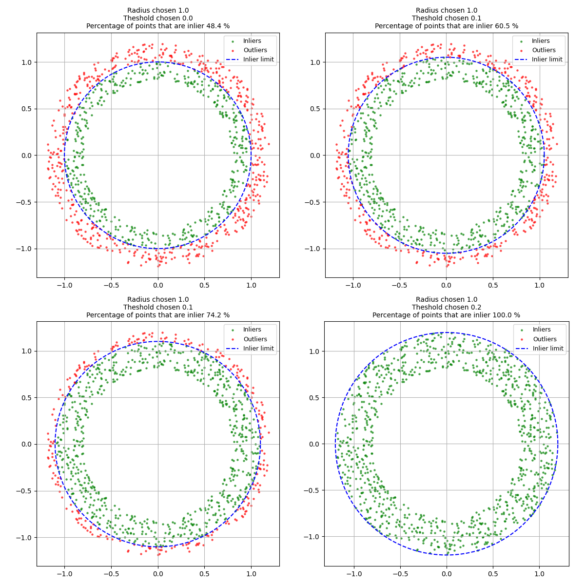

# VSMOD, a Vessel Segmentation and MODelization 3D Slicer plugin
<!-- TOC -->
- [VSMOD, a Vessel Segmentation and MODelization 3D Slicer plugin](#vsmod-a-vessel-segmentation-and-modelization-3d-slicer-plugin)
  - [Overview 🌐](#overview-)
  - [Installation 📂](#installation-)
  - [How to use the plugin 💡](#how-to-use-the-plugin-)
    - [The centerline tab ➰](#the-centerline-tab-)
      - [Advanced RANSAC configuration 🔬](#advanced-ransac-configuration-)
    - [The segmentation tab 🧩](#the-segmentation-tab-)
      - [Advanced features ⚙️](#advanced-features-️)
  - [Acknowledgments and citations 🙏](#acknowledgments-and-citations-)
<!-- TOC -->
## Overview 🌐

VSMOD is a 3D Slicer plugin that aims to ease Vessel Segmentation and MODelization for angiography images.

The plugin works thanks to a [RANSAC](https://en.wikipedia.org/wiki/Random_sample_consensus) algorithm that tries to fit cylinders into vessels you want to track in order to approximate their shape.

The vessels are defined by a centerline, an evolving radius along the centerline, and contour points. This data is later used to generate seeds that initialize a region-growing segmentation.

To perform a full modeling process, follow these three steps:

1) Place points to indicate the vessel's direction and diameter.
2) Start a centerline segmentation from these points; repeat steps 1 and 2 until you have captured all desired vessels.
3) Once all vessels are defined, paint the segmentation to generate an initial region-growing seed.

## Installation 📂

To install the plugin, you have to do the following steps:

1) Download the plugin as a zip file or clone this repository. If you downloaded a zip file, extract it. You can clone/extract it wherever you want.
2) Start 3D Slicer, in the `module` drop-down menu, click on `Developer Tools -> Extension Wizard`.
3) Click on `Select Extension`, a folder tab will appear, select the repository folder / the zip folder you extracted, and click on `Choose`.
4) A popup will show, select `Yes`.⚠️ Make sure you are connected to the internet. When loading the module, it will check if you have all the dependencies and attempt to download the missing ones. ⚠️
5) After downloading the missing dependencies, 3D Slicer will be automatically restarted, the plugin can be found in the module drop-down menu, under the `Segmentation` category.

[plugin_install.webm](https://github.com/user-attachments/assets/1708b30e-80d1-4638-b632-66233986236f)

Tips: If you struggle to find any of those modules, you can use the magnifying glass to search modules by name.

## How to use the plugin 💡

The plugin is divided into two tabs:

- **Centerline** which is used to create a tree from the vessels' centerline.
- **Segmentation** which creates a segmentation and fills it according to the centerline tree.

### The centerline tab ➰

In order to make a segmentation, you first have to create a vessel centerline tree.
To do so, you have to use the tools present in the centerline tab.

You must select a volume, a starting point, a list of direction points, and a distance line (all except the volume are created and selected by default).

Once the prerequisites are met, click on the `Place a new starting and direction point` button to add two points: one indicating the starting position and the other indicating the direction for the algorithm to follow.

Next, measure the vessel's diameter near your previously placed points. Click the `Measure diameter` button, then place two points along the vessel's diameter; the measured value will be automatically entered in the diameter field. Alternatively, if you prefer not to measure the diameter again, check the `Automatic Diameter Selection` box to use the diameter from the closest previously fitted cylinder.

Additionally, you can configure the `Centerline Resolution` parameter to ensure that a point is generated at least every X mm, which refines the centerline after tracking.

Finally, click on the `Create root` / `Create new branch` button in order to start finding a centerline !

note: the first time you will start a tracking, the program will compile some crucial functions (it will also happen each time you modifies the files that needs to be compiled), and thus will result in a 1-2 minutes of 3D Slicer freezing asking to be shutdown. Do not shut it down.

[plugin_first_branch.webm](https://github.com/user-attachments/assets/49aeac4d-01bd-46be-b817-89c26a63b19d)

Once the processing is done, you can add new branches to the tree by adding two new starting and direction points by doing the same process.

[plugin_second_branch.webm](https://github.com/user-attachments/assets/da9bfca0-50b5-47d3-9756-d57a20a47c6c)

You can delete a branch from the hierarchy by clicking on the bin icon, or clear the whole tree by clicking on the `Clear tree` button.

[plugin_delete_branch.webm](https://github.com/user-attachments/assets/1c0039ad-1181-4614-aa62-0001164b3219)

If the centerline is correct until a certain point where it is not, you can delete the irrelevant part by selecting the last correct point and right-clicking the concerned artery in the hierarchy, and selecting `Remove end of the branch`.
This correction is also available for the beginning of the root which can be removed as well.
[plugin_trim_branch.webm](https://github.com/user-attachments/assets/6c716997-13ac-4b99-bb9d-bd057f574819)

If you want, you can also save the hierarchy of all the vessel points into a NetworkX graph, which is exported in a `.json` file. The json file can later be used to reload a previous hierarchy thanks to the `Load Tree from graph` button.

[plugin_save_branch.webm](https://github.com/user-attachments/assets/a5157365-29db-429f-a3f0-905d2e4af7dd)

#### Advanced RANSAC configuration 🔬

This tab is made to configure how the RANSAC algorithm will behave.

**How the RANSAC algorithm works:**

In this plugin, RANSAC is used to fit cylinders inside a vessel to approximate its shape. Points are sampled from a region around the vessel, and the algorithm tries to build cylinders from these points. It evaluates each cylinder based on the distance of points to its central axis, categorizing points as "inliers" or "outliers", and ultimately selects the cylinder with the most inliers. Consequently, the parameters control the algorithm's flexibility.

These are the configurable parameters of the RANSAC algorithm, and their meaning:

- `Inlier points`: A threshold parameter defining the minimum number of inliers required for a cylinder to be considered valid.
- `Threshold`: The maximum allowed distance (as a fraction of the cylinder's radius) for a point to be considered an inlier. For example, if the previous cylinder radius is 1 mm, a point 1.2 mm away is considered an inlier with a threshold of 33%, since \(1.2 - 1 = 0.2\) and \(0.2 < 0.33\).

Here is an illustration showing a point cloud with points at distances between 0.8 and 1.2 from the cylinder axis and the impact of the `Theshold` parameter on the inliers.


- `Maximum inter-cylinder angle`: The maximum angle allowed between two consecutive cylinders. For highly curved vessels, you may set this value near 90°; for straighter vessels, closer to 60°.

- `Min Attempts per Cylinder`: The minimum number of attempts the algorithm will make to find a suitable cylinder.
- `Max Attempts per Cylinder`: The maximum number of attempts the algorithm will make if it does not find a suitable cylinder. (Thus, the actual number of tries will lie in the interval \([minimum, minimum + maximum]\).)
- `Max Cylinders per Vessel`: The maximum number of cylinders the algorithm can fit during a single tracking session.

### The segmentation tab 🧩

The segmentation tab is straightforward. You have a button labeled `Create Segmentation Seeds`. Clicking this button generates a new segmentation, which serves as the initialization for 3D Slicer's region-growing algorithm. You can further adjust or edit the generated segmentation using the segmentation widget.

[plugin_seeds_branch.webm](https://github.com/user-attachments/assets/e964a692-283a-4a8b-aae8-798d1b8a32c3)

To finalize segmentation, you just have to run 3D Slicer's region-growing algorithm which can be found in the plugin directly in the tools of the segmentation widget.

[plugin_region_branch.webm](https://github.com/user-attachments/assets/42419fda-2f2b-4487-8ff7-668e8ef312fd)

#### Advanced features ⚙️

Through the `Segmentation Options` panel, you can further adjust how the segmentation is generated.

Two parameters help to avoid over-segmentation of large vessels:

- `Reduction Factor` and `Diameter Lowering Threshold`: These reduce the diameter of vessels that exceed a certain threshold by a given factor. For instance, the following code demonstrates the process:

```python
if diameter <= reduction_threshold:
  segmented_diameter = diameter
else:
  # This ensures a continuous transition of the diameter values.
  segmented_diameter = (diameter - reduction_threshold) * reduction_factor + reduction_threshold
```

- `Distance of Contour Region`: Configures the gap between the vessels and the external boundary.

- `Merge all vessels into a single segment`: Allows you to merge all individual vessel segments into one.

## Acknowledgments and citations 🙏

This plugin was initially an end-of-study project, made by Azéline Aillet (Former student at EPITA) and Gabriel Husak (Former student at EPITA), under the direction of Odyssée Merveille (CREATIS) and Morgane Des Ligneris (CREATIS).

The RANSAC code is based on the previous work of Jack CARBONERO (CReSTIC), Guillaume DOLLE (LMR) and Nicolas PASSAT (CReSTIC) on the plugin vestract.

The hierarchy code is based on the work of Lucie Macron (Kitware SAS), Thibault Pelletier (Kitware SAS), Camille Huet (Kitware SAS), Leo Sanchez (Kitware SAS) from the RVesselX plugin.

The IXI002-Guys-0828-MRA.nii.gz file used in the tests is part of the IXI MRA image dataset and can be found [here](https://brain-development.org/ixi-dataset/). This specific data file is made available under the Creative Commons [CC BY-SA 3.0](https://creativecommons.org/licenses/by-sa/3.0/legalcode) license.
